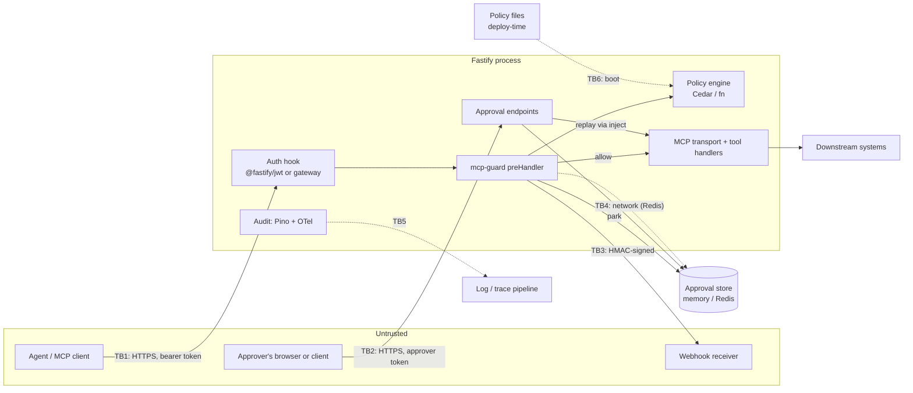

# Threat model

- **Version:** v0 (draft, M0)
- **Date:** 2026-09-23
- **Method:** STRIDE per element along the `tools/call` path
- **Related:** [ADR-001](./adr/001-hook-vs-proxy.md), #7; the final version for the v0.1 release is #53

This document lists what `fastify-mcp-guard` protects, where trust changes hands, and how each threat is handled. v0 is written before the implementation exists, so every mitigation is a **requirement** that links to the issue that delivers it. The final version (#53) will record what was verified.

## What the guard protects

| Asset | Why it matters |
| --- | --- |
| **The ability to run tools** | The main asset. Tools act on real systems: payments, records, infrastructure. |
| **Tool arguments** | They decide what a tool does (amount, account, resource ID) and may contain personal or financial data. |
| **Policies** | They define who may do what. If they can be changed or bypassed, the guard is meaningless. |
| **Approval records** | A pending call's stored body, hash, requester, approver and state. They authorize execution. |
| **Audit trail** | Evidence of every decision, needed for accountability and regulatory review. |
| **The tool catalogue** | The list of tools a principal can see. It reveals capability and attack surface. |

## System and trust boundaries

| Boundary | Crossing | Trust assumption |
| --- | --- | --- |
| **TB1** Agent → Fastify | Every MCP request | Everything in the request body is attacker-controlled. The agent may be compromised or prompt-injected. |
| **TB2** Approver → approval endpoints | Approve or reject | Approvers are authenticated separately and may be malicious or mistaken. |
| **TB3** Guard → webhook receiver | Approval notifications | The network and receiver are untrusted. The payload must be authenticated and minimal. |
| **TB4** Guard ↔ approval store | Park, transition, expire | Redis is shared infrastructure. Other clients may be able to read or write keys. |
| **TB5** Audit → log and trace sinks | Every decision | Sinks are read by more people than the tool's callers. Sensitive data must not leak. |
| **TB6** Policy files → engine | Boot | Policy files are trusted code, protected by the deployment pipeline (review, CI, signed images). |

## Assumptions

1. **Authentication happens before the guard.** An auth hook (for example `@fastify/jwt` in `onRequest`) verifies the token. The guard trusts the principal returned by the configured resolver and does not verify tokens itself.
2. **The guarded route is the only way to reach the MCP server's tools** (ADR-001). Other routes, ports or transports that reach the same handlers are not protected.
3. **TLS is terminated by Fastify or a trusted proxy.** Transport security is out of scope.
4. **Policy files and plugin options come from the deployment,** never from requests.
5. **The MCP transport hands tool handlers the same body Fastify parsed** (`request.body`), not a second parse of the raw stream. Confirmed per transport in #9.

## STRIDE analysis

Legend: **✅ requirement** (delivered by the linked issue) · **📄 documented** (deployer responsibility) · **⏳ open** (decision pending)

### Spoofing

| # | Threat | Mitigation |
| --- | --- | --- |
| S1 | Agent calls tools with a forged or unverified identity | 📄 Auth is required before the guard (assumption 1). ✅ The guard **fails closed**: if the resolver throws or returns no principal, it denies (#12). |
| S2 | Agent reuses another client's `Mcp-Session-Id` to inherit their identity | ✅ The principal always comes from the verified token on each request, never from MCP session state (#12). |
| S3 | Someone impersonates an approver | ✅ Approval endpoints require an approver scope on a verified token (#39). |
| S4 | Forged approval notification sent to the webhook receiver | ✅ HMAC-SHA256 signature over the body with a timestamp, so receivers can reject stale or replayed deliveries (#41). |

### Tampering

| # | Threat | Mitigation |
| --- | --- | --- |
| T1 | **Argument swap:** the agent changes arguments between approval and execution | ✅ Park-and-replay (ADR-004). The stored original body is hashed at park time and verified before replay. The agent never re-sends the call (#38, #40). |
| T2 | A denied call is hidden inside a JSON-RPC batch | ✅ Every batch entry is evaluated on its own. A batch never runs entries the policy did not allow (#10). |
| T3 | **Parser differential:** duplicate JSON keys, or a second parse downstream, means the guard sees different arguments from the tool | ✅ The guard decides on Fastify's single parsed body (ADR-001). 📄 Transports must use `request.body` (assumption 5, #9). |
| T4 | Prototype pollution via `__proto__` or `constructor` in arguments | ✅ Fastify's `secure-json-parse` rejects these by default. The guard must not loosen `onProtoPoisoning` or `onConstructorPoisoning`, and tests cover it (#10, #16). |
| T5 | Tool name tricks (case, Unicode lookalikes, extra whitespace) match a permissive rule or miss a deny rule | ✅ Exact, case-sensitive matching against registered tool names. **Unknown tools are denied by default** (ADR-003, #23). |
| T6 | Approval records are edited directly in Redis | 📄 Use Redis ACLs and TLS, and give the store its own key prefix and user. ✅ The replay hash check detects a changed body (#40). |
| T7 | Policy files are changed at runtime | ✅ Policies are compiled once at boot, with no runtime reload endpoint (#20). 📄 Policy files go through code review and CI (TB6). |

### Repudiation

| # | Threat | Mitigation |
| --- | --- | --- |
| R1 | A principal denies having made a call | ✅ Every decision emits one audit event with principal, tool, decision, matched policy IDs, request ID and latency (#28). |
| R2 | An approver denies having approved | ✅ Every approval transition records the approver's identity and timestamp, and emits an audit event linked by approval ID and trace (#39, #28, #30). |
| R3 | Audit events are dropped or altered after emission | 📄 Out of scope (ADR-005). Ship logs to an append-only SIEM. The guard never writes audit events to a store it controls. |

### Information disclosure

| # | Threat | Mitigation |
| --- | --- | --- |
| I1 | `tools/list` reveals tools the principal cannot call | ✅ `tools/list` is filtered by the same policy as `tools/call`, for both JSON and SSE responses (#22, ADR-003). |
| I2 | Sensitive arguments (IBANs, personal data) end up in logs, spans or webhook payloads | ✅ Configurable redaction paths are applied to audit events and span attributes (#29, #30). Webhook payloads carry the approval ID, tool name and a redacted summary, not raw arguments (#41). |
| I3 | Deny responses reveal policy logic, for example which condition failed | ✅ A stable JSON-RPC error code with a minimal `data` shape. Policy IDs and reasons go to the audit log, not the client (#14). |
| I4 | Error messages or stack traces leak internals when the engine fails | ✅ Engine errors produce a generic deny to the client and full detail in the audit log (#13, #14). |

### Denial of service

| # | Threat | Mitigation |
| --- | --- | --- |
| D1 | Oversized bodies or huge batches exhaust CPU or memory | ✅ Rely on Fastify's `bodyLimit`, plus a configurable maximum batch size in the interceptor (#10). |
| D2 | Expensive policies slow every call | ✅ Policies are compiled at boot. The latency budget (<1 ms p99) is enforced by a benchmark regression job in CI (#15, #31, #32). |
| D3 | An agent floods the approval queue with pending calls | ✅ A per-principal cap on pending approvals, and TTL expiry (#35, #36, #37). |
| D4 | A slow or failing webhook receiver blocks request handling | ✅ Notification is sent asynchronously with bounded retries and a timeout, and never blocks the pending response (#41). |
| D5 | The approval store is unavailable | ✅ Fail closed: if a call can't be parked, it is denied, never allowed (#38). |

### Elevation of privilege

| # | Threat | Mitigation |
| --- | --- | --- |
| E1 | **Route bypass:** tools are reachable through another route, port or transport | 📄 The guarded route must be the only ingress (assumption 2, README). ⏳ Consider a startup warning if other routes share the MCP handler (#11). |
| E2 | **Hook order:** the guard runs before authentication and sees no principal | ✅ Fails closed (S1). ✅ Register as `fastify-plugin` with documented ordering, and test it (#11, #16). |
| E3 | **Fail open:** an engine exception or timeout results in allow | ✅ Any error, timeout or unknown outcome from the engine becomes a deny. Tests cover every failure path (#13, #26). |
| E4 | **Self-approval:** the requester approves their own call | ✅ Separation of duties: the approver's principal must differ from the requester's (#39). |
| E5 | **Replay:** one approval is used to run a call more than once | ✅ Approvals are single-use, with atomic state transitions (`Approved → Executed/Failed`) in both stores (#36, #37, #40). |
| E6 | **Race conditions:** double approval, approval after expiry, approval during replay | ✅ Atomic transitions (Lua or `WATCH` in Redis), plus race tests (#37, #42). |
| E7 | **Policy gap:** a new tool is added without a policy and is callable | ✅ Default deny for unknown tools (ADR-003, #23). ✅ The `assertDecision` helper lets users test policies in their own CI (#24). |
| E8 | **Other methods run tools:** other MCP methods, or future spec additions, reach tool code without being `tools/call` | ⏳ v0.1 only guards `tools/call` and `tools/list`. Decide whether unrecognized methods pass through or are denied, and document it (#10, #17). `resources/*` and `prompts/*` are roadmap (#59). |

## Out of scope for v0.1

- Authentication, token verification and TLS (assumptions 1 and 3)
- Prompt injection or harmful content inside tool arguments (a non-goal; the guard constrains *what* can be done, not *why* the agent asked)
- The integrity of logs after they are emitted (ADR-005)
- The stdio transport, and non-Fastify MCP servers
- Compromise of the host process, Node.js runtime or dependencies (see Dependabot and npm provenance, #5)

## Open items for the final version (#53)

- [ ] E8: behaviour for unrecognized JSON-RPC methods
- [ ] E1: whether a startup check for unguarded routes is feasible
- [ ] Confirm assumption 5 for each supported transport (#9)
- [ ] Decide how `require_approval` is surfaced to clients (#17) and review its disclosure (I3)
- [ ] Mark each ✅ as verified, with the test that proves it
